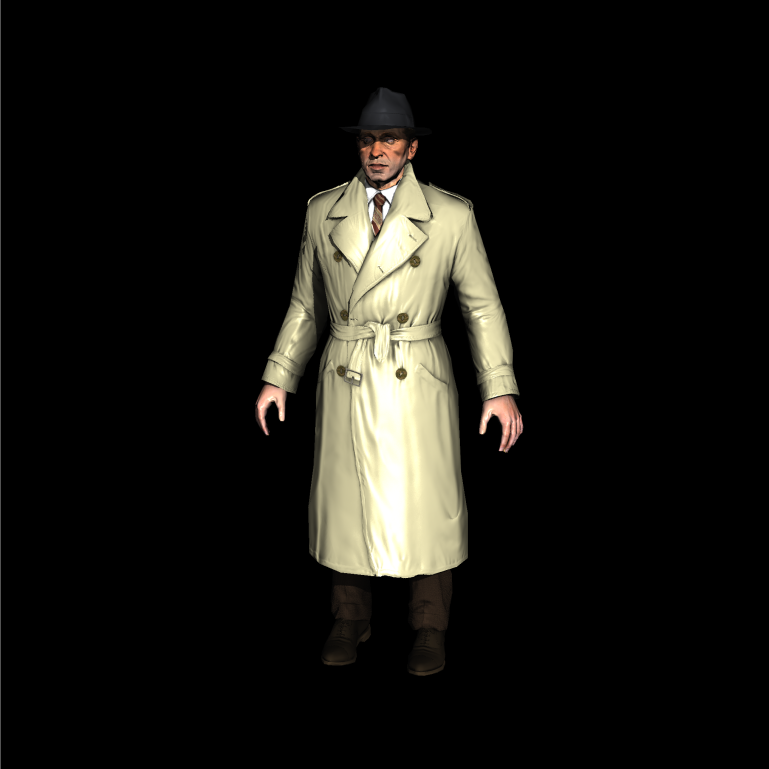
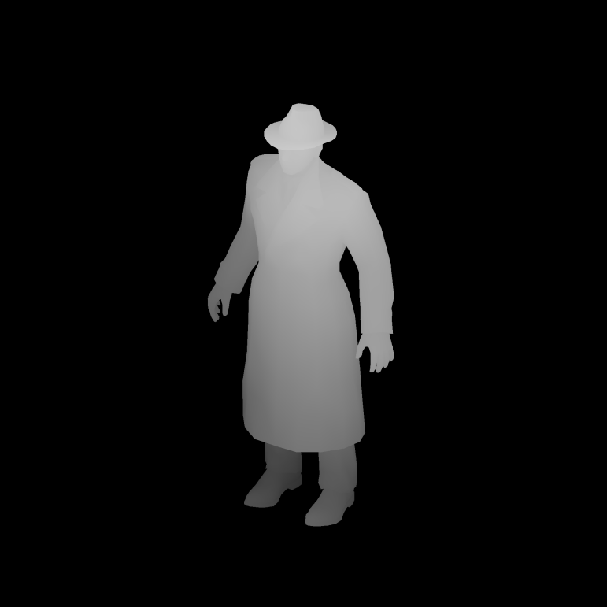

# Mini Renderer

## Build

```bash
mkdir build
cd build
cmake ..
```

Build with Visual Studio

## Feature 

+ Shader based √
+ Homogeneous clipping
+ Back-face culling
+ Perspective correct interpolation
+ Depth testing √
+ Alpha testing
+ Alpha blending
+ Cubemapped skybox
+ Skeletal animation
+ Tangent space normal mapping √
+ Shadow mapping √
+ ACES tone mapping
+ Physically based rendering (PBR)
+ Image-based lighting (IBL)

## Result

+ Boogie




+ Boogie ShadowMap-Depth




## Reference

+ [tinyrenderer](https://github.com/ssloy/tinyrenderer)